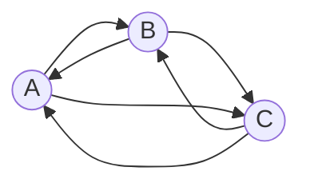

# Задание №3 Вариант 2 
## Задача на взаимную рекурсию (маршруты в треугольнике) + биномиальный коэффициент
1. В файле main.py реализовать функцию *get_triangle_path_count*, принимающую длину маршрута и возвращающую количество маршрутов заданной дины между тремя вершинами.
2. В файле main.py реализовать функцию *binomial_coefficient*, принимающую два числа n и k и возвращающую значение биномиального коэффициента C из n по k. Вычисление коэффициента необходимо реализовать **как рекурсивно, так и итеративно**. Для вычисления коэффициента использовать функцию 

$$
C^k_n=\frac{n}{k} C^{k-1}_{n-1}
$$

## Примечания
- Для реализации функции *get_triangle_path_count* использовать **взаимную рекурсию**.
- Для функции *binomial_coefficient* параметр **use_rec определяет использовать рекурсивную реализацию или итеративную**, значение по умолчанию False, то есть используется итеративная реализация.
- Разработку вести в отдельной ветке, созданной на основе данной. В названии ветки префикс main заменить на название команды.
- Корректность работы функции *get_triangle_path_count* проверить запустив файл test.py с модульными тестами.
- Корректность работы функции binomial_coefficient проверить запустив файл test.py с модульными тестами.

## Маршруты в треугольнике

Путешественник перемещается между тремя городами A, B и C по трем дорогам и каждый день переходит из одного города в другой. Сколько различных замкнутых маршрутов, начинающихся и заканчивающихся в городе A может проделать путешественник за *n* дней.

Пример расчета количества маршрутов.

| *n* | Маршруты                   | Количество |
|-----|----------------------------|------------|
| 1   | нет                        | 0          |
| 2   | (A->B->A), (A->C->A)       | 2          |
| 3   | (A->B->C->A), (A->C->B->A) | 2          |

Можно обозначить
* an - количество маршрутов длины *n* начинающихся и заканчивающихся 
в A,
* bn - количество маршрутов длины *n* начинающихся в A и 
заканчивающихся в B,
* cn - количество маршрутов длины *n* начинающихся в A и 
заканчивающихся в C.

Тогда справедливы равенства:

$$
\begin{cases}
a_n = b_{n-1} + c_{n-1}
\\
b_n = a_{n-1} + c_{n-1}
\\
c_n = a_{n-1} + b_{n-1}
\end{cases}
$$

С учетом полученных начальных значений *a*, *b* и *c*
* a1 = 0, b1 = 1, c1 = 1
* a2 = 2, b2 = 1, c2 = 1

Можно реализовать рекурсивные взаимные функции *a(n), b(n), c(n)*.

## Биномиальные коэффициенты  
  
Биномиальный коэффициент $C^k_n$ равен числу сочетаний из n по k. Может быть 
вычислен по формуле:

$$
C^k_n=\frac{n!}{k!(n-k)!}
$$

Для указанной формулы можно вынести за скобки $\frac{n}{k}$ и получить:

$$
C^k_n=\frac{n}{k} C^{k-1}_{n-1}
$$

Согласно правилу Паскаля, для любых натуральных чисел *n* и *k*, для которых 
1 ⩽ *k* ⩽ *n* :

$$
C^k_n=C^k_{n-1}+C^{k-1}_{n-1}
$$
